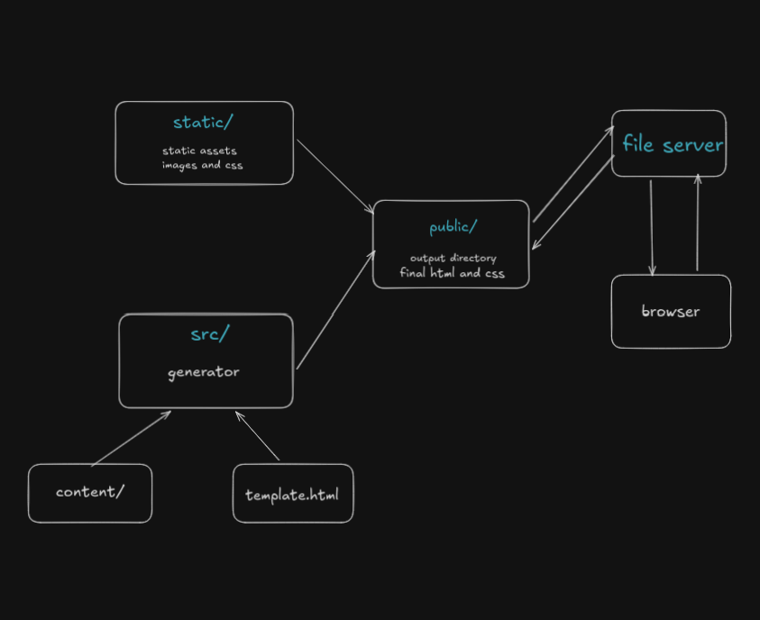

idea:
- split md into blocks
- convert each block to tree of `HTMLNode` objs

  raw md -> `TextNode` -> `HTMLNode`
- join all html nodes

TODO:
- [X] dont split newlines and codeblocks
- [X] replace lt and gt signs
- [X] add support for latex: use mathjax
- [X] add support for syntax highlighting
- [ ] use metadata in each md to get date, link, title for post
- [ ] seperate page for `/blogs`
- [ ] add latest 5 posts on home
- [ ] add config file which stores navbar links, etc
